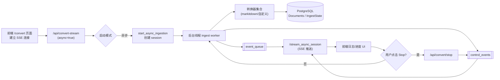
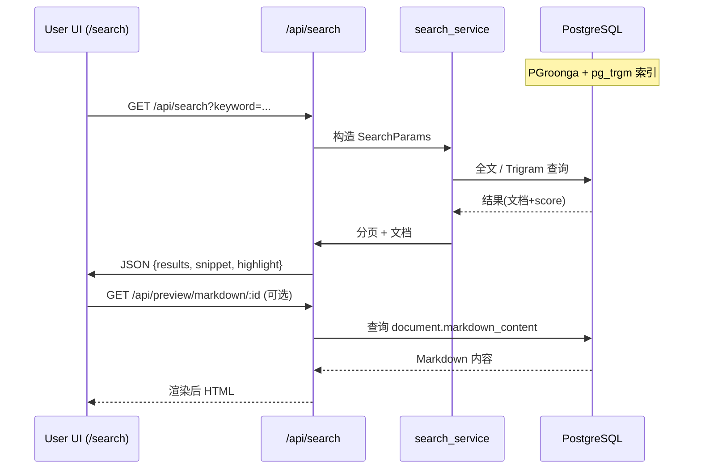

# 本地文档搜索系统

> 把“分散在本地硬盘 / Joplin / 微信公众号抓取 / 图片 / 视频 / 思维导图 / Draw.io 图表”的知识统一加工为 *Markdown 语料层*，并提供毫秒级检索、结构化预览与可拓展的多模态增强。

一个基于 **Flask + PostgreSQL** 的轻量级本地知识检索系统：支持多格式自动转换、增量索引、全文 + 模糊搜索、异步导入、会话重连、图片 OCR/语义描述、视频元数据抽取、XMind/Draw.io 解析，以及 Joplin / 微信采集整合。

## ✨ 主要功能

- **📁 智能文件夹扫描**：递归扫描本地文件夹，可根据修改时间 / 文件类型做增量或全量索引（基于 `IngestState.cursor_updated_at`）。
- **✍️ Joplin 笔记同步**：通过脚本从本地 Joplin 应用的 API 同步笔记，实现对知识库的全文搜索。
- **📄 强大的格式转换**：聚合 `markitdown` + 自定义转换器，支持 `.pdf`, `.docx`, `.pptx`, `.xlsx`, `.html`, `.md`, `.txt`, 常见代码/脚本、XMind、Draw.io、图片（OCR+描述）、视频（元数据占位）。**HTML** 单独分类（区分结构化 Office/PDF）。
- **🚀 高性能全文搜索**：集成 **PGroonga** 扩展，为文档内容和文件名提供高速、精准的全文搜索能力。
- **✍️ 模糊与相似度搜索**：利用 **pg_trgm** 扩展，支持文件名和内容的 trigram 模糊匹配，即使有拼写错误也能找到相关结果。
- **🖥️ 简洁易用的 Web 界面**：
    - 提供清晰的搜索页面，支持关键词搜索。
    - 搜索结果列表会生成包含关键词的**内容摘要**并**高亮**显示。
    - 支持点击文件名预览完整的 Markdown 内容。
    - 支持从搜索结果中直接调用系统默认程序打开本地的原始文件。
- **🧠 多模态增强**：图片 → 本地 OCR / LLM 语义描述（可链式降级 Provider），写入 Front Matter；可扩展视频字幕、关键帧解析。
- **🎬 视频占位转换**：抽取元数据（ffprobe）形成 Markdown：后续可接入字幕/章节/摘要。
- **🗺️ 思维导图与图表**：XMind / Draw.io 转 Markdown（页面 + 节点列表），便于结构检索。

## 🛠️ 技术栈

- **后端**: Python 3, Flask, SQLAlchemy
- **数据库**: PostgreSQL
- **数据库扩展**: PGroonga (全文搜索), pg_trgm (模糊搜索)
- **前端**: 原生 HTML, CSS, JavaScript (无复杂框架)
- **核心依赖**: 
    - `Flask-Migrate`: 用于数据库结构迁移。
    - `psycopg2-binary`: PostgreSQL 驱动。
    - `markitdown[all]`: 强大的多格式文件转 Markdown 工具。
    - `python-dotenv`: 用于管理环境变量。
    - `requests`: 用于 API 请求。

## ⚙️ 安装与设置

#### 1. 环境准备
- 确保您已经安装了 Python 3.10+ 和 Git。
- 安装并运行 **PostgreSQL** (建议版本 12+)。

#### 2. 克隆与安装依赖
```bash
# 1. 克隆项目
git clone <your-repository-url>
cd local_document_search

# 2. (可选但推荐) 创建并激活 Python 虚拟环境
python -m venv venv
# Windows: .\venv\Scripts\activate | macOS/Linux: source venv/bin/activate

# 3. 安装依赖
pip install -r requirements.txt
```

#### 3. 配置环境变量
项目使用 `.env` 文件管理配置。我们提供了一个模板文件 `.env.example`。

```bash
# 1. 从模板复制配置文件
# Windows
copy .env.example .env
# macOS/Linux
cp .env.example .env

# 2. 编辑 .env 文件，至少修改以下两项：
#    - DATABASE_URL: 修改为您自己的数据库用户名、密码和库名。
#    - JOPLIN_API_TOKEN: 填入您从 Joplin 获取的 API 令牌。
```

#### 4. 配置数据库
- 在 PostgreSQL 中创建一个新的数据库（例如，`document_search`）。
- 连接到您刚创建的数据库，并启用 `pg_trgm` 和 `pgroonga` 扩展。您可以使用 `psql` 或任何图形化工具执行以下 SQL 命令：
  ```sql
  CREATE EXTENSION IF NOT EXISTS pg_trgm;
  CREATE EXTENSION IF NOT EXISTS pgroonga;
  ```
  > **重要**: PGroonga 可能需要单独安装。请参考 [PGroonga 官方安装文档](https://pgroonga.github.io/install/) 完成在您操作系统上的安装。

#### 5. 初始化数据库
首次运行或代码更新后，需要初始化或更新数据库表结构。
```bash
# 设置 Flask 应用入口 (仅在当前终端会话中有效)
# Windows (CMD): set FLASK_APP=run.py
# Windows (PowerShell): $env:FLASK_APP="run.py"
# macOS/Linux: export FLASK_APP=run.py

# 应用数据库迁移 (将创建或更新所有表和索引)
flask db upgrade
```

## 🚀 快速开始

### 1. 启动 Web 应用
在项目根目录下运行：
```bash
python run.py
```
打开浏览器，访问 `http://127.0.0.1:5000`。

> ⚠️ **取消按钮需要并发**：单线程模式下 SSE 长连接会阻塞取消端点；`run.py` 通过 `threaded=True` 解决。生产请使用多 worker / 线程（gunicorn / waitress / uwsgi 等）。

### 2. 导入本地文件夹文档（异步 + 可重连）
-   点击页面上的“文档转换”链接，或直接访问 `/convert`。
-   在输入框中填入您想要扫描的本地文件夹的**绝对路径**。
-   点击“开始转换”按钮，程序将开始在后台扫描和处理文件。

#### 2.1 异步导入机制

当前 `/api/convert-stream` 默认以 **异步后台线程 + 队列** 方式运行：

| 层级 | 组件 | 说明 |
|------|------|------|
| 线程 | ingest worker | 后台扫描/转换文件，事件写入 `event_queue` |
| 队列 | `event_queue` | 普通事件（处理、成功、失败...）|
| 控制队列 | `control_events` | 取消确认（`cancel_ack`）等优先事件 |
| SSE | `stream_async_session` | 周期性 flush 队列 + 发送心跳 `debug_state` |
| 状态 | `INGEST_SESSIONS` | 内存保存 session metadata（folder_path, params, history 等）|

页面刷新 / 离开后重返：`/api/convert/sessions/history` → 回放最近历史（默认保留 1000 条非 debug 事件）→ 继续附加 SSE。

#### 2.2 取消（Stop）协议

在“文档转换”页面启动扫描后，系统会为本次任务分配一个 `session_id` 并通过 **所有** SSE 事件发送到前端。

停止按钮工作逻辑：
1. 前端在收到首个包含 `session_id` 的事件后缓存该值；
2. 用户点击 Stop 时，向 `POST /api/convert/stop` 发送 `{ session_id }`（或单会话自动识别）；
3. 后端立即标记 `stop=True` 并在下一次循环检查时首先推送一条 `stage=cancel_ack`（提前确认“已收到取消”）；
4. 若取消发生在“等待开始处理下一个文件”阶段，`cancel_ack` 之后紧跟 `cancelled`；
5. 若取消发生在某个大文件处理中：
  - 当前文件仍会继续直至转换函数结束；
  - 然后依次发送：`cancel_ack`（after current file）→ `cancelled`；
6. 最终仍会发送 `done` 汇总（`level=warning`），总结已处理/跳过/错误文件数。

事件阶段补充：
| stage | 含义 |
|-------|------|
| cancel_ack | 已收到取消请求（可能在文件之间，或文件之后）|
| cancelled | 实际停止主循环，不再处理后续文件 |

额外特性：
* 若调用 `POST /api/convert/stop` 时未携带 `session_id` 且仅存在 **一个** 活动会话，系统会自动取消该会话（便于调试场景）。
* 可以通过 `GET /api/convert/sessions` 查看当前活动会话列表。

重要提示：
- 取消不会回滚已写入数据库的已完成文件；
- 正在转换的单个大文件（例如大 PDF）无法“中断其内部解析”，但会在该文件完成后立即终止整体循环；
- 前端收到 `cancelled` 后会追加日志，并在最终 `done` 阶段摘要中看到处理进度。

如果你需要更“硬”的中断（比如长时间的外部工具执行），可后续扩展：
- 在转换函数中引入分段式检查；
- 使用子进程执行转换并支持 `terminate()`；
- 引入任务队列（如 RQ/Celery）支持异步撤销。

### 3. 同步 Joplin 笔记
此功能通过命令行脚本执行。

**准备工作:**
1.  确保您已在 `.env` 文件中正确配置 `JOPLIN_API_TOKEN`。
2.  确保您的 Joplin 桌面应用正在运行，并且 Web Clipper 服务已开启 (`工具` -> `选项` -> `Web Clipper`)。

**执行同步:**
- **增量同步** (推荐，只同步上次同步后有更新的笔记):
  ```shell
  python scripts/import_joplin.py
  ```
- **全量同步** (强制重新同步所有笔记):
  ```shell
  python scripts/import_joplin.py --full
  ```

### 4. 图片描述 Provider 链式降级 (IMAGE_PROVIDER_CHAIN)

支持为图片语义描述配置多 provider 降级链。例如：

```
IMAGE_CAPTION_PROVIDER=google-genai
IMAGE_PROVIDER_CHAIN=openai,google-genai,local
```

执行顺序：按照 `IMAGE_PROVIDER_CHAIN` 顺序逐个尝试；若链为空，则仅使用 `IMAGE_CAPTION_PROVIDER`。若 `IMAGE_CAPTION_PROVIDER` 不在链中，会被自动插入到链首，确保首选优先。

日志示例：
```
[ProviderFallback] attempt=1 provider=openai mode=llm file=img1.png
[ProviderFallback] failed attempt=1 provider=openai error=...OpenAIError...
[ProviderFallback] attempt=2 provider=google-genai mode=llm file=img1.png
```

全部失败时：
```
[ProviderFallback] all_failed file=img1.png errors=provider=openai error=...; provider=google-genai error=...
```

提示：将 `local` 置于链末可在外部 API 不可用时仍回退到本地 OCR（若安装了 Pillow + pytesseract）。

### 5. 搜索文档
处理完成后，访问主页 (`/`) 或搜索页 (`/search`)，即可查找已处理过的所有文档。

### 6. 微信文章下载与直接入库

公众号文章在下载完成后**立即**执行 HTML -> Markdown 转换并写入 `documents` 表，不再经过二次目录扫描：

- 避免重复 I/O 与延迟；
- 直接标记 `conversion_type = HTML_TO_MD`；
- 若转换失败，会将该记录 `status='failed'` 并保留 `error_message` 便于排查；
- 再次下载同标题/路径且文件未变化时会跳过；如果之前失败且文件更新时间有变化会重新尝试。

重新处理历史已下载 HTML 可使用：
```bash
python scripts/reprocess_html.py --only-missing
```

### 7. 图片 OCR 与 EXIF Front Matter
#### 7.1 日志时间格式统一

应用内部日志与访问日志均已统一为 `YYYY-MM-DD HH:MM:SS` 格式：

示例：
```
2025-09-20 19:28:54 | app.services.wechat_service | INFO | _download_article_content:539 | 成功下载文章: ...
127.0.0.1 - - [2025-09-20 19:28:57] "GET /api/search?..." 200 -
```

自定义：可在 `.env` 中设置：
```
LOG_TIME_FORMAT=%Y-%m-%d %H:%M:%S
```
访问日志由自定义 `ISORequestHandler` 输出，内部日志通过 `setup_logging` 中的 `datefmt` 统一控制。


当环境变量 `IMAGE_CAPTION_PROVIDER=local` 时，系统使用 `pytesseract` 对图片执行本地 OCR，并在生成的 Markdown 顶部插入一个 YAML Front Matter 区块，包含：

```
---
source_file: 原始文件名
provider: local-ocr
hash_sha256: 文件内容 SHA256
file_size: 字节大小
modified_time: 文件修改时间 (ISO8601)
exif: 可能包含 DateTimeOriginal / Model / Make / LensModel / FNumber / ExposureTime / ISOSpeedRatings / FocalLength / Orientation / Software / GPSInfo / Width / Height / Mode / Format 等字段
ocr_lang: OCR 使用的语言 (由 TESSERACT_LANG 指定, 默认 eng)
---
# 文件名
<OCR 识别出的正文>
```

说明：
- 若图片无 EXIF 或部分字段缺失，对应键会被省略或 `exif: {}`。
- 该 Front Matter 旨在支持后续扩展（如缓存、溯源、检索过滤）。
- 切换到 `IMAGE_CAPTION_PROVIDER=openai` 或 `google-genai` 时，将使用 LLM 生成更语义化的图像描述；此模式下暂不添加上述 Front Matter（后续可统一）。
- 设置 `TESSERACT_LANG=chi_sim` 可提高中文图片识别质量（前提：系统已安装对应语言包）。

未来计划：加入可选配置以关闭 front matter，及图片 caption 缓存机制。

### 8. 视频文件元数据占位转换 (实验性)

当前已对常见视频格式 (`.mp4`, `.mkv`, `.mov`, `.webm`) 支持“元数据 -> Markdown 占位”模式：

## 🌐 界面多语言 (简体中文 / English)

系统内置一个轻量级自定义 i18n 机制，无第三方依赖：

### 1. 语言判定优先级
1. URL 查询参数 `?lang=zh|en`
2. 浏览器 Cookie `lang`
3. 默认语言：`zh`

访问示例：
```
http://127.0.0.1:5000/search?lang=en
http://127.0.0.1:5000/process?lang=zh
```

### 2. 切换语言
侧边栏底部提供语言切换按钮；点击后：
* 写入 cookie `lang=<目标语言>; max-age=31536000`
* 用当前 URL + 新 `lang` 参数重新加载

### 3. 后端翻译结构
文件：`app/i18n.py`
```python
_TRANSLATIONS = {
  'zh': { 'nav.search': '搜索', ... },
  'en': { 'nav.search': 'Search', ... }
}
```
通过上下文注入模板辅助函数：
* `t(key)` 取翻译，不存在时回退原 key
* `current_lang` 当前语言
* `lang_toggle` 目标切换语言（用于按钮）

### 4. 前端动态文本
对于运行期 JS 生成的文本（如实时日志 / 搜索结果提示 / 分页按钮）：
* 在模板头部或相关块中注入全局对象（例如 `window.SEARCH_I18N`、`window.ERROR_I18N`、`window.I18N`）。
* JS 逻辑统一引用这些对象，避免散落硬编码。

示例（搜索页分页按钮）：
```javascript
paginationHTML += `<a ...>${window.SEARCH_I18N.pagination.next}</a>`;
```

### 5. 新增翻译步骤
1. 在 `app/i18n.py` 中为中英文同时添加键；命名建议：`域.子域.语义`（如 `search.results.loading` / `errors.action.retry`）。
2. 模板中静态文本：直接 `{{ t('your.key') }}`。
3. JS 动态文本：在模板用 Jinja 注入对象 `window.XXX = { key: "{{ t('...') }}" }`。
4. 避免在纯 JS 发起的异步响应里再做翻译（保持前端决定语言）。

### 6. 常见扩展建议
* 若需增加语言：复制 `en` 块生成 `ja` / `fr` 等，再暴露入口。
* 可以加一个调试开关，在 `t()` 未命中时 `console.warn('[i18n-miss]', key)`。
* 若翻译量增大，可拆为多个模块文件并在启动时合并。

### 7. 限制说明
* 该方案是轻量级：不含复数规则 / 参数化格式化（当前使用简单 `str.replace`）。
* 如需复杂 ICU MessageFormat，可后续引入 `babel` / `format.js`。

---
**快速检查**：
```bash
# 查看所有翻译 key（粗略）
grep -R "t('" -n app/templates | head
```

如需后续：抽取未使用 key 统计 / 自动检测硬编码，可再补充辅助脚本。

```
---
source_file: demo.mp4
provider: video-metadata
hash_sha256: ...
file_size_bytes: 1234567
modified_time: 2025-09-20T12:34:56.789012
video:
  format_name: mov,mp4,m4a,3gp,3g2,mj2
  duration_seconds: 734.2
  duration_human: 12:14.200
  bit_rate: 1234567
  video_codec: h264
  audio_codec: aac
  width: 1920
  height: 1080
  avg_frame_rate: 30/1
  nb_streams: 2
file_size_human: 1.18 MB
---
# demo.mp4

(视频元数据占位，尚未生成转录内容)
```

实现方式：调用系统 `ffprobe`（来自 FFmpeg）。如果未安装，转换会返回错误信息。后续计划：
- 集成本地/云端 ASR 生成字幕与章节
- 场景分割与关键帧 OCR
- 多模态摘要（可选 LLM）
- 缓存与增量更新（基于 hash）

可配置项预留（未来）：
`VIDEO_TRANSCRIPT_PROVIDER`, `VIDEO_ASR_MODEL`, `VIDEO_SCENE_DETECT`, `VIDEO_KEYFRAME_OCR` 等。

### 9. Draw.io 图表转换 (新增)

### 10. 文件类型与转换矩阵

| 分类 | 典型扩展 | ConversionType | 说明 |
|------|----------|---------------|------|
| NATIVE | md | DIRECT | 原生 Markdown 直接入库 |
| PLAIN_TEXT | txt | TEXT_TO_MD | 直接包裹为 Markdown 文本 |
| CODE | py, sh, sql, ... | CODE_TO_MD | 保留语法块，未来可做语义摘要 |
| STRUCTURED | pdf, docx, pptx, xlsx, ... | STRUCTURED_TO_MD | 依赖 markitdown 提取结构/文本 |
| HTML | html, htm | HTML_TO_MD | HTML 单独分类，便于筛选 |
| XMIND | xmind | XMIND_TO_MD | 结构化节点输出 |
| DRAWIO | drawio | DRAWIO_TO_MD | 多页面 + 节点列表 |
| IMAGE | png, jpg, ... | IMAGE_TO_MD | OCR + caption + Front Matter |
| VIDEO | mp4, mkv, ... | VIDEO_METADATA | 元数据占位，后续可加字幕 |

> 实际支持集合来源：`config.FILE_TYPE_CONFIG` 中的单一真源，可在此集中扩展。

### 11. 架构与数据流（概要）

1. 用户在前端发起导入 → SSE 建立 (`/api/convert-stream?folder_path=...`)
2. 后端 `start_async_ingestion` 创建 session：
   - 初始化 `IngestState`
   - 生成文件列表 `find_files`（时间/类型过滤）
   - 后台线程逐个转换：
     - 读取 sidecar `.meta.json`（可含 `source_url`）
     - 检测是否未变化（`modified_time` + 记录）跳过
     - 执行分类转换（markitdown / 自定义转换器）
   - 期间产生事件推入队列
3. SSE 端周期拉取并推送事件；心跳事件 `debug_state` 包含：索引、队列长度、active_sessions。
4. 前端 UI：日志区域 + 进度条 + 取消；刷新后自动通过 `/sessions/history` 重建。
5. 搜索：`/api/search` → PGroonga/pg_trgm 混合 + snippet 高亮 → 预览 Markdown 或打开源文件。

#### 11.1 导入事件流（Mermaid）



说明：
* control_events 优先发送取消确认等；
* history（未在图内单列）用于页面刷新重放；
* 单页面多会话时 active_sessions 用于调试与 Stop-All。

#### 11.2 搜索执行路径（Mermaid）



未来可扩展：
* 加入向量检索（ANN）侧路；
* SearchParams 中增加 embedding / rerank 阶段；
* 结果缓存层（Redis）。

### 12. SSE 事件规范

| 字段 | 类型 | 示例 | 说明 |
|------|------|------|------|
| level | string | info/warning/error/critical | 日志级别 |
| stage | string | scan_start/file_processing/done/... | 生命周期阶段 |
| session_id | string | 32hex | 会话标识 |
| message | string | Processing file 3/20: a.pdf | UI 文本 |
| progress | int | 45 | 百分比（可选）|
| current_file | string | a.pdf | 当前处理文件名（可选）|
| summary | object | {processed:..} | 仅 done 时包含 |

常见 stage 列表：`scan_start`, `session_info`, `scan_complete`, `file_processing`, `file_skip`, `file_success`, `file_error`, `cancel_ack`, `cancelled`, `done`, `critical_error`, `debug_state`。

### 13. 取消与重连内部状态

Session 内存结构（示例）：
```python
{
  session_id: {
    'folder_path': 'E:/docs/A',
    'params': {...},
    'event_queue': deque(),
    'control_events': [],
    'history': deque(maxlen=1000),
    'stop': False,
    'done': False,
    'mode': 'async'
  }
}
```

### 14. 关键脚本

| 脚本 | 用途 |
|------|------|
| `scripts/import_joplin.py` | 增量/全量同步 Joplin 笔记 |
| `scripts/reindex_fts.py` | 重新（或修复）全文索引（如添加 PGroonga 后）|
| `scripts/init_db.py` | 初始化数据库（迁移之外的辅助）|
| `scripts/xmind2md.py` | 独立测试 XMind 转换 |
| `scripts/import_wechat.py` (若存在) | 微信文章批量处理（或集成于 service）|

### 15. 配置项速览（节选）

| 变量 | 说明 | 默认 |
|------|------|------|
| `DATABASE_URL` | PostgreSQL 连接串 | - |
| `LOG_LEVEL` | 日志等级 | INFO |
| `LOG_TIME_FORMAT` | 日志时间格式 | `%Y-%m-%d %H:%M:%S` |
| `DOWNLOAD_PATH` | 微信文章下载根目录 | `downloads` |
| `IMAGE_CAPTION_PROVIDER` | 图片描述 Provider (`local`/`openai`/`google-genai`) | `google-genai` |
| `IMAGE_PROVIDER_CHAIN` | Provider 降级链，逗号分隔 | 空 |
| `ENABLE_IMAGE_FRONT_MATTER` | 是否写入图片 Front Matter | true |
| `TESSERACT_LANG` | 本地 OCR 语言包 | `chi_sim+eng` |
| `JOPLIN_API_TOKEN` | Joplin API Token | - |
| `JOPLIN_API_URL` | Joplin API 基础地址 | `http://localhost:41184` |

> 更多请查看 `config.py`。

### 16. 常见问题 (FAQ)

**Q: 点击 Stop 没反应？**  
A: 确认运行方式是否带并发（`threaded=True` 或多 worker）。若日志中无 `cancel_ack` 事件，说明取消请求未进入队列。

**Q: 为什么有时取消后还在处理一个大文件？**  
A: 当前文件内部转换不可中断（同步函数），等待该文件完成才会发送 `cancelled`。可改造成子进程+轮询提前终止。

**Q: 刷新页面后为什么日志能恢复？**  
A: 使用内存 `history`（非 debug 事件环形缓存）+ 再次附加 SSE 流。

**Q: 可以多目录同时导入吗？**  
A: 后端仍保留 `/api/convert/batch`（UI 已隐藏），可通过 curl 请求并分别订阅生成的多个 SSE URL。

**Q: 搜索慢？**  
A: 检查是否启用 PGroonga 扩展；若未安装会退化为普通 LIKE（显著变慢）。

**Q: PGroonga 安装困难？**  
A: 可先用 pg_trgm 模糊检索 + 基础索引；后续再迁移。

### 17. Roadmap (节选)

- [ ] 会话持久化（重启后恢复）
- [ ] 事件落库 / WebSocket 模式
- [ ] 视频字幕 / 章节生成 + OCR 关键帧
- [ ] 图片 caption 结果缓存与去重
- [ ] 更细粒度权限（私有目录隔离）
- [ ] RESTful API 文档自动化 (OpenAPI)
- [ ] Mermaid / Graph 可视化导出 (XMind / Draw.io)
- [ ] 多进程任务队列（Celery / RQ）与任务优先级

### 18. 贡献指南 (简要)

1. Fork & 克隆仓库
2. 创建特性分支：`git checkout -b feat/your-feature`
3. 运行 `flake8` / 基础测试（未来补充 CI）
4. 提交 PR 时请描述：动机 / 主要修改 / 回滚方式
5. 尽量保持转换/搜索行为的幂等性与可回溯性

建议添加：
> 若引入新文件类型，请：
> 1. 更新 `config.FILE_TYPE_CONFIG`
> 2. 在转换服务添加处理逻辑
> 3. 更新 README “文件类型与转换矩阵”
> 4. 补充测试样例（放入 `tests/fixtures`）

现已支持将 `.drawio` 文件转换为结构化 Markdown，提取每个页面 (diagram) 中的节点文本。输出格式示例：

```
# example.drawio

总共 2 个页面，5 个文本项目
---

## Page-1
- 开始
- 处理步骤
- 结束

## Page-2
- 另一页节点
```

说明：
- 标题行使用原始文件名。
- 第二行统计页面数量与节点（文本）总数。
- `---` 作为结构分隔（非 YAML Front Matter）。
- 每个页面以二级标题 `## 页面名` 开头，节点以无序列表 `- 文本` 形式列出。
- 文本内容会去除 HTML 标签并反转常见实体（`&lt;`, `&gt;`, `&amp;` 等）。
- 若页面没有可提取文本，输出 `*此页面没有找到文本内容*`。

支持的解析策略：
1. 直接内嵌 `<mxGraphModel>` → 直接遍历 `root` 下 `mxCell` 的 `value` 属性。
2. 压缩/编码数据：若 diagram 文本节点为压缩 + base64（或仅 base64 / URL 编码）存储，会自动尝试多级解码（含 `zlib` raw/标准、base64、`unquote`）。

局限与后续计划：
- 目前仅抽取节点文本，不包含连线语义、布局或样式。
- 后续可选：生成关系表 / Mermaid 流程图 / 语义摘要。
- 可扩展 Front Matter（例如 diagram 节点计数 / 页面名称列表）用于更细粒度检索。

## 🏗️ 项目结构

```
local_document_search/
├── app/                      # Flask 应用核心代码
│   ├── routes/               # 路由蓝图 (视图函数)
│   ├── services/             # 核心业务逻辑 (文件扫描, 转换, 搜索)
│   ├── templates/            # HTML 模板
│   ├── utils/                # 辅助工具函数
│   ├── __init__.py           # 应用工厂函数
│   └── models.py             # SQLAlchemy 数据模型
├── migrations/               # Flask-Migrate 数据库迁移脚本
├── scripts/                  # 辅助脚本 (如 Joplin 导入)
├── tests/                    # 单元测试
├── .env                      # 环境变量 (需从 .env.example 复制创建)
├── .env.example              # 环境变量模板
├── config.py                 # 配置文件
├── requirements.txt          # Python 依赖
└── run.py                    # 应用启动入口
```

## 🏗️ 开发

### 数据库迁移
当您修改了 `app/models.py` 中的数据模型后，需要执行以下命令来生成并应用数据库迁移：

```bash
# 1. 生成迁移脚本 (会自动检测模型变更)
flask db migrate -m "A short description of the changes"

# 2. 应用迁移到数据库
flask db upgrade
```

## 📄 许可证

本项目采用 MIT 许可证。

---

如果你觉得该项目有用：欢迎 Star / Issue / PR。  
也欢迎针对 *异步模型、视频多模态、检索增强* 等路线提出建议。
